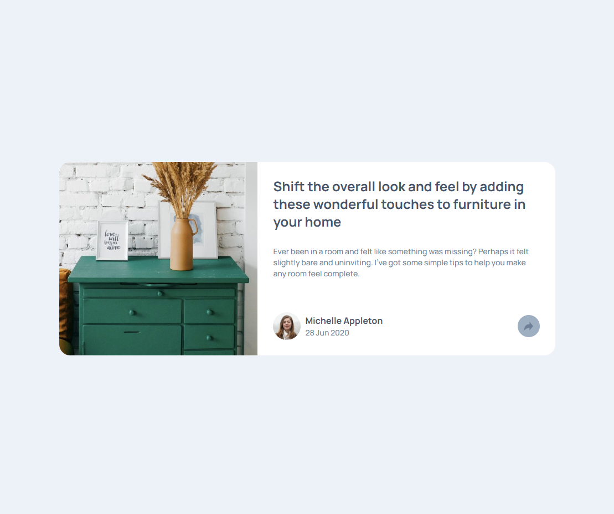
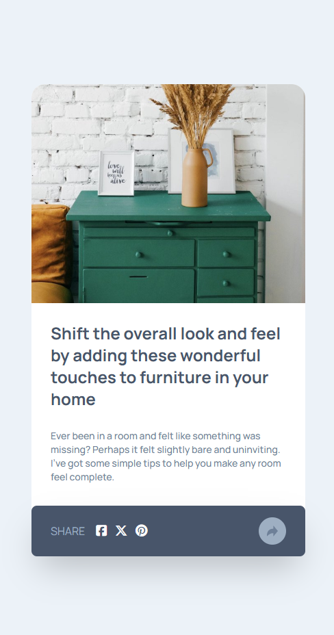

# Article Preview Component

## A responsive card with interactive share functionality

This project implements an article preview card designed to showcase content in a compact and visually appealing format. The card includes a share button that appears above the main button on larger screens and expands to take the full width on smaller screens, demonstrating responsive and interactive UI behavior.

The component emphasizes clean layout, adaptive design, and interactive elements, providing a polished user experience across different devices.

#### Image of the Desktop Design

#### Image of the Mobile Design

- [React](https://react.dev/) - JS library
- [TypeScript](https://www.typescriptlang.org/) - type superset of JS
- [Tailwindcss](https://tailwindcss.com/) - utility-first CSS framework

## Author

- Website - [Mihailo Djurovic](portfolio-miahilo.vercel.app)
